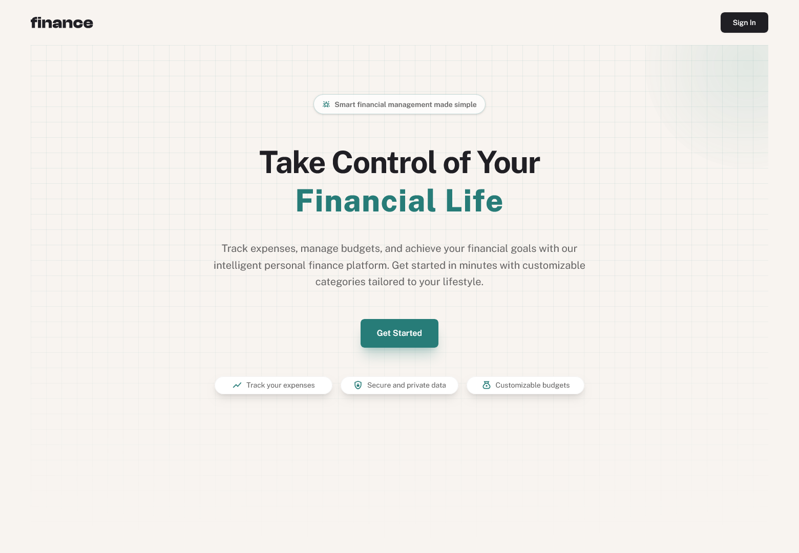

# Personal Finance App

A full‑stack personal finance application built with Next.js App Router and MongoDB. Track transactions, budgets, pots (savings goals), and recurring bills with rich tables, charts, and keyboard‑accessible UI.

## Tech stack

- Next.js 15
- TypeScript
- Tailwind CSS v4
- Shadcn UI components
- TanStack Table v8 (data table, sorting, filtering, pagination)
- Recharts (charts)
- MongoDB Node.js Driver v6
- ESLint + Prettier (with Tailwind plugin)
- Authentication system built using Better-Auth library

## Features

- Overview page summarizing balances, spending, categories, and charts
- Transactions with search, sort, filtering, and pagination
- Budgets CRUD (create/update/delete), with spend vs limit and category themes
- Pots (savings goals) with add/withdraw actions and progress tracking
- Recurring Bills summary with Paid/Upcoming/Due Soon logic for the current cycle (monthly)
- Optimized data fetching via next/cache + tag-based revalidation
- Keyboard‑navigable components and responsive layout

## Prerequisites

- Node.js 18.18+ (or 20+)
- MongoDB database (local or hosted)

## Environment variables

Create a .env file in the project root with:

```env
MONGODB_URI=your-mongodb-connection-string
MONGODB_NAME=your-database-name
BETTER_AUTH_SECRET=your-random-secret-string
BETTER_AUTH_URL=your-app-url
```

The variables are validated at runtime using Zod (see src/lib/load-env.ts). Missing values will throw on boot.

## Install and run

Using pnpm (recommended):

- pnpm install
- pnpm dev

Using npm:

- npm install
- npm run dev

Build and start production server:

- pnpm build && pnpm start

Other scripts:

- pnpm lint – run ESLint
- pnpm prettier – format with Prettier

## Styling

- Tailwind CSS v4 is used
- Design custom tokens (CSS variables) define theme, chart colors, and sidebar palette.

## Screenshots



## Deployment

- Set MONGODB_URI and MONGODB_NAME in your hosting provider’s environment settings.
- Set BETTER_AUTH_SECRET to a random secure string.
- Set BETTER_AUTH_URL to your app’s public URL or your localhost URL for dev mode.
- Ensure your MongoDB IP access list allows your host to connect.

## License

Licensed under the MIT License. See the [LICENSE](LICENSE) file for details.

## Author

- This project was developed by Ahmad Yousif.

- [Frontend Mentor](https://frontendmentor.io/profile/AhmadYousif89)
- [GitHub](https://github.com/AhmadYousif89)
